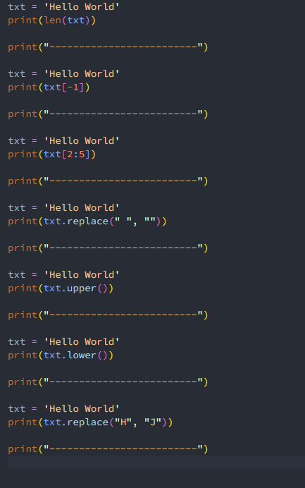

# Pertemuan 14 String Lanjutan

## Latihan 1

### Soal Latihan 1 

txt = 'Hello World'  

- Hitung jumlah karakternya  
- Ambil karakter terakhir 
- Ambil karakter index ke-2 sampai index ke-4 (llo) 
- Hilangkan spasi pada text tersebut (HelloWorld) 
- Ubah text menjadi huruf besar 
- Ubah text menjadi huruf kecil 
- Ganti karakter H dengan karakter J 

Code Perogram nya 
 

Hasil Code Program Nya 
 
