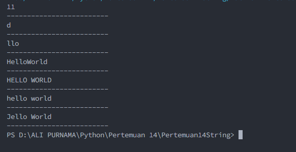

# Pertemuan 14 String Lanjutan

## Latihan 1

### Soal Latihan 1</br>

txt = 'Hello World' </br>

- Hitung jumlah karakternya </br>
- Ambil karakter terakhir</br>
- Ambil karakter index ke-2 sampai index ke-4 (llo)</br>
- Hilangkan spasi pada text tersebut (HelloWorld)</br>
- Ubah text menjadi huruf besar</br>
- Ubah text menjadi huruf kecil</br>
- Ganti karakter H dengan karakter J</br>

Code Perogram nya</br>

```python
txt = 'Hello World'

#Hitung jumlah karakternya
print(len(txt))

print("-------------------------")

#Ambil karakter terakhir
txt = 'Hello World'
print(txt[-1])

print("-------------------------")

#Ambil karakter index ke-2 sampai index ke-4 (llo)
txt = 'Hello World'
print(txt[2:5])

print("-------------------------")

#Hilangkan spasi pada text tersebut (HelloWorld)
txt = 'Hello World'
print(txt.replace(" ", ""))

print("-------------------------")

#Ubah text menjadi huruf besar
txt = 'Hello World'
print(txt.upper())

print("-------------------------")

#Ubah text menjadi huruf kecil
txt = 'Hello World'
print(txt.lower())

print("-------------------------")

#Ganti karakter H dengan karakter J
txt = 'Hello World'
print(txt.replace("H", "J"))

print("-------------------------")
```

Hasil Code Program Nya</br>
</br>
